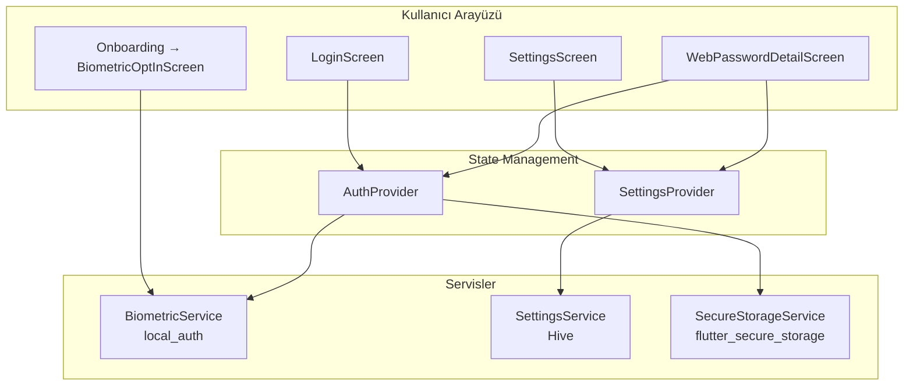
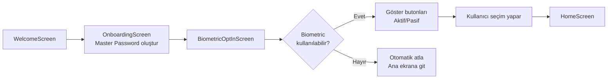
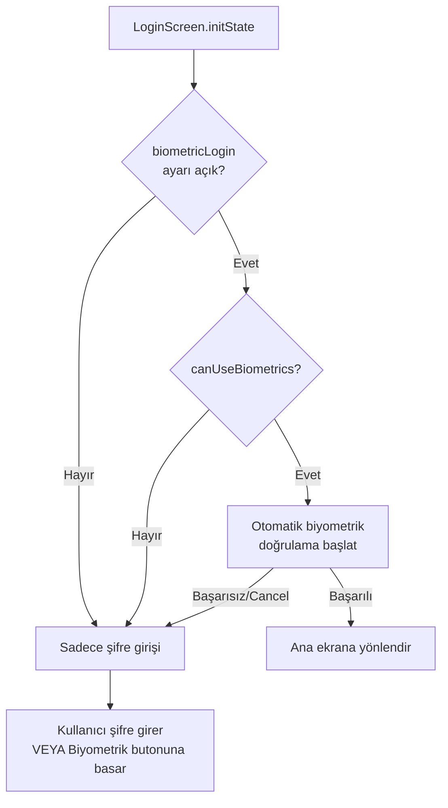
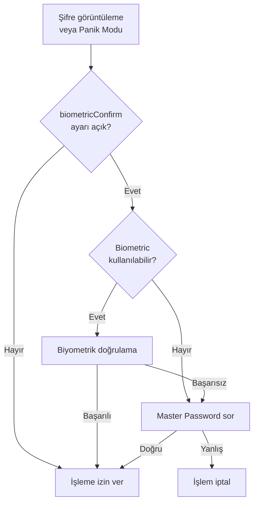

# Biyometrik Giriş ve Onay Sistemi Analizi

## 📋 Genel Bakış

Bu doküman, Guarden Password Manager uygulamasının biyometrik kimlik doğrulama sisteminin kapsamlı analizini sunmaktadır. Sistem iki ana özellik içerir:

1. **Biyometrik Giriş (Biometric Login)** - Uygulamaya hızlı erişim için
2. **Biyometrik Onay (Biometric Confirmation)** - Hassas işlemler için ek güvenlik katmanı

---

## 🏗️ Mimari Yapı



---

## 📁 Bileşenler ve Sorumluluklar

### 1. BiometricService
**Dosya:** [`lib/services/biometric_service.dart`](../lib/services/biometric_service.dart)

| Metod | Açıklama |
|-------|----------|
| `canCheckBiometrics()` | Cihazda biyometrik doğrulama kullanılabilir mi? |
| `getAvailableBiometrics()` | Kullanılabilir biyometrik türleri döndürür |
| `authenticate({reason})` | Biyometrik doğrulama diyaloğu gösterir |

**Özellikler:**
- `local_auth` paketini kullanır
- Web platformunda otomatik devre dışı (`kIsWeb` kontrolü)
- Hata yönetimi: `MissingPluginException`, `PlatformException`
- `biometricOnly: false` ayarı ile PIN/Pattern yedeği mümkün

---

### 2. SettingsService (Biyometrik Ayarlar)
**Dosya:** [`lib/services/settings_service.dart`](../lib/services/settings_service.dart)

**Saklanan Anahtarlar:**
```dart
static const String _biometricLoginKey = 'biometricLogin';      // Bool
static const String _biometricConfirmKey = 'biometricConfirm';  // Bool
```

**Metodlar:**
- `biometricLogin` (getter/setter)
- `biometricConfirm` (getter/setter)

**Depolama:** Hive kutusu (`settings_box`)

---

### 3. AuthProvider (Biyometrik Kilid Açma)
**Dosya:** [`lib/providers/auth_provider.dart`](../lib/providers/auth_provider.dart)

| Metod | Açıklama |
|-------|----------|
| `canUseBiometrics()` | Cihaz biyometrik destekliyor mu? |
| `biometricUnlock()` | Biyometrik doğrulama + veritabanı açma |

**Akış:**
```
biometricUnlock()
    ├── BiometricService.authenticate()
    ├── DatabaseService.initDatabase()
    └── AuthState.authenticated (state update)
```

**⚠️ Güvenlik Notu:** Biyometrik doğrulama sadece "kimlik doğrulama" olarak kullanılır. Şifreleme anahtarını **doğrudan** biyometrik doğrulamaya bağlamaz. Bu, biyometrik verinin gizliliğini korur.

---

### 4. SettingsProvider
**Dosya:** [`lib/providers/settings_provider.dart`](../lib/providers/settings_provider.dart)

**State Özellikleri:**
```dart
final bool biometricLogin;    // Giriş için biyometrik
final bool biometricConfirm;  // Hassas işlemler için onay
```

**Metodlar:**
- `toggleBiometricLogin(bool value)`
- `toggleBiometricConfirm(bool value)`

---

## 🔄 Kullanıcı Akışları

### Akış 1: İlk Kurulum (Onboarding)



**Dosya:** [`lib/screens/onboarding/biometric_optin_screen.dart`](../lib/screens/onboarding/biometric_optin_screen.dart)

---

### Akış 2: Giriş (Login)



**Otomatik Biyometrik:** [`login_screen.dart:28-39`](../lib/screens/auth/login_screen.dart:28)

---

### Akış 3: Hassas İşlem Onayı



**Kullanılan Yerler:**
- [`web_password_detail_screen.dart:33-44`](../lib/screens/web_passwords/web_password_detail_screen.dart:33) - Şifre görüntüleme
- [`settings_screen.dart:77-109`](../lib/screens/settings/settings_screen.dart:77) - Panik modu ve yedekleme

---

## ⚙️ Ayarlar Ekranı

**Dosya:** [`lib/screens/settings/settings_screen.dart:680-696`](../lib/screens/settings/settings_screen.dart:680)

```dart
_buildNotifToggle(
  icon: Icons.fingerprint,
  label: 'Biyometrik Kilit Acma',
  value: settingsArgs.biometricLogin,
  onChanged: (val) => ref.read(settingsProvider.notifier).toggleBiometricLogin(val),
),

_buildNotifToggle(
  icon: Icons.enhanced_encryption_outlined,
  label: 'Hassas Islem Onayi',
  value: settingsArgs.biometricConfirm,
  onChanged: (val) => ref.read(settingsProvider.notifier).toggleBiometricConfirm(val),
),
```

---

## 🔒 Güvenlik Analizi

### Güçlü Yönler:

1. **Platform Kontrolü:** Web'de otomatik devre dışı
2. **Hata Yönetimi:** Tüm biyometrik hataları yakalar
3. **Fallback:** Cihaz biyometriği desteklemiyorsa şifre girişine düşer
4. **Veritabanı Koruması:** Biyometrik sadece doğrulama, şifreleme anahtarı ayrı saklanır

### Dikkat Edilmesi Gerekenler:

1. **AuthProvider.biometricUnlock:** Biyometrik doğrulama sonrası veritabanı açılıyor, ancak şifreleme anahtarı hâlâ `SecureStorage`'da. Bu, biyometrik veri ile şifreleme anahtarının doğrudan bağlantılı olmadığı anlamına gelir.

2. **WebPasswordDetailScreen._authenticate:** Biyometrik cihaz yoksa otomatik izin veriyor:
   ```dart
   if (!canUse) return true; // Fallback
   ```
   Bu, güvenlikten önce kullanılabilirliği tercih eder.

3. **Yedekleme İşlemleri:** Biyometrik onaylı olsa bile yedekleme için master password gerekiyor (şifreleme/deşifreleme için).

---

## 📊 Kullanılan Paketler

| Paket | Kullanım |
|-------|----------|
| `local_auth` | Biyometrik kimlik doğrulama |
| `local_auth/error_codes` | Hata kodları (notAvailable, notEnrolled) |
| `flutter_secure_storage` | Şifreleme anahtarı saklama |
| `hive` | Ayarların yerel depolanması |

---

## 🐛 Bilinen Davranışlar

1. **iOS/Android Farkı:** `biometricOnly: false` ayarı Android'de PIN/Pattern yedeğine izin verir
2. **Hata Kodları:** `notAvailable` (donanım yok), `notEnrolled` (parmak izi/yüz kaydedilmemiş)
3. **State Yönetimi:** Biyometrik ayarlar `SettingsProvider` üzerinden yönetilir, değişiklikler anında yansır

---

## 💡 Öneriler

1. **Biyometrik Kilitleme Süresi:** Belirli bir süre sonra otomatik kilitleme eklenebilir
2. **Biyometrik Deneme Sınırı:** Başarısız denemeler sonrası master password zorunluluğu
3. **Biyometrik Değişiklik Algılama:** Cihaza yeni parmak izi eklendiğinde uyarı gösterimi

---

## 📁 İlgili Dosyalar

- [`lib/services/biometric_service.dart`](../lib/services/biometric_service.dart) - Temel servis
- [`lib/providers/auth_provider.dart`](../lib/providers/auth_provider.dart) - Kimlik doğrulama mantığı
- [`lib/providers/settings_provider.dart`](../lib/providers/settings_provider.dart) - Ayar yönetimi
- [`lib/services/settings_service.dart`](../lib/services/settings_service.dart) - Ayar depolama
- [`lib/screens/onboarding/biometric_optin_screen.dart`](../lib/screens/onboarding/biometric_optin_screen.dart) - İlk kurulum
- [`lib/screens/auth/login_screen.dart`](../lib/screens/auth/login_screen.dart) - Giriş ekranı
- [`lib/screens/settings/settings_screen.dart`](../lib/screens/settings/settings_screen.dart) - Ayarlar
- [`lib/screens/web_passwords/web_password_detail_screen.dart`](../lib/screens/web_passwords/web_password_detail_screen.dart) - Hassas işlem onayı örneği
