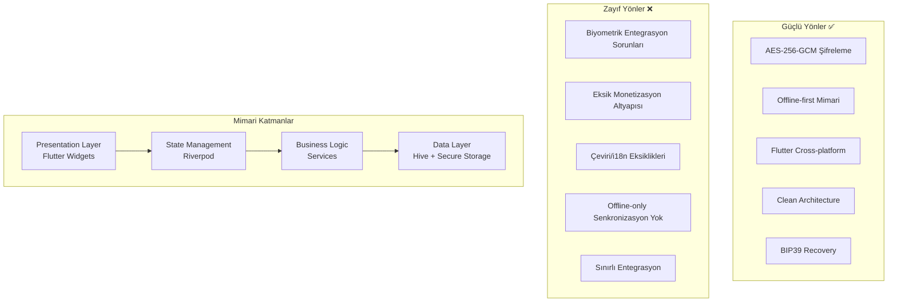
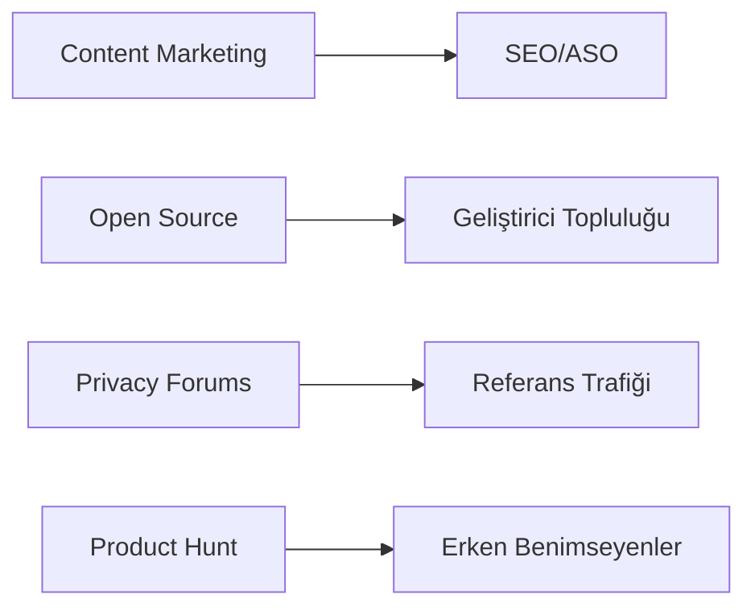

# Guarden Password Manager - Stratejik Yol Haritası 2026-2030

## 📋 Executive Summary

Guarden Password Manager, Flutter tabanlı, offline-first bir şifre yöneticisidir. AES-256-GCM şifreleme, biyometrik kimlik doğrulama ve neumorfik tasarım ile orta düzeyde güvenlik odaklı kullanıcılara hitap etmektedir.

**Mevcut Durum:** MVP aşamasında, temel özellikler çalışır durumda ancak kritik biyometrik entegrasyon sorunları bulunmaktadır.

---

## 🏗️ Mevcut Mimari Değerlendirmesi

### Teknik Altyapı



### Güvenlik Altyapısı Analizi

| Bileşen | Uygulama | Endüstri Standardı | Değerlendirme |
|---------|----------|-------------------|---------------|
| Şifreleme | AES-256-GCM | ✅ AES-256 | Uygun |
| Key Derivation | PBKDF2 100k iterasyon | ✅ 100k+ | Uygun |
| Anahtar Depolama | Keychain/Keystore | ✅ Hardware-backed | Uygun |
| Biyometrik | local_auth | ✅ Native API | **Sorunlu** |
| Backup | Manuel Export/Import | ⚠️ Otomasyon yok | Yetersiz |
| 2FA/MFA | Yok | ❌ U2F/WebAuthn | Eksik |

### Tespit Edilen Teknik Borçlar

1. **🔴 Kritik:** Biyometrik ayar kaydetme sorunu ( onboarding'de kayıt yok)
2. **🟡 Yüksek:** i18n çeviri sistemi hatalı (çok sayıda missing translation)
3. **🟢 Orta:** HIBP (Have I Been Pwned) entegrasyonu "yakında" modunda
4. **🟢 Orta:** Autofill framework tam test edilmemiş

---

## 🎯 Pazar Analizi ve Konumlandırma

### Küresel Şifre Yöneticisi Pazarı

```
2024: ~2.5 milyar USD
2029: ~6.5 milyar USD (CAGR: 21%)
```

**Ana Oyuncular:**
- **1Password** - Premium, enterprise odaklı ($36/yıl)
- **LastPass** - Freemium, güvenlik skandalları sonrası düşüşte
- **Bitwarden** - Açık kaynak, $10/yıl (fiyat-performans lideri)
- **Dashlane** - Premium, $60/yıl
- **NordPass** - NordVPN ekosistemi
- **Apple/Google Passwords** - Ücretsiz, native entegrasyon

### Guarden'in Konumlandırması

```mermaid
quadrantChart
    title Fiyat vs Özellik Zenginliği
    x-axis Düşük Fiyat --> Yüksek Fiyat
    y-axis Temel Özellikler --> Gelişmiş Özellikler
    
    quadrant-1 Premium (1Password, Dashlane)
    quadrant-2 Bütçe Dostu Premium (Bitwarden)
    quadrant-3 Temel/Entry Level (Google Passwords)
    quadrant-4 Niş/Pazar Yeni Giren (Guarden)
    
    "1Password": [0.7, 0.9]
    "Bitwarden": [0.2, 0.8]
    "LastPass": [0.5, 0.5]
    "Apple Passwords": [0.0, 0.4]
    "Guarden": [0.3, 0.4]
```

### Hedef Kitle Segmentasyonu

| Segment | Özellikleri | Guarden Uygunluğu |
|---------|-------------|-------------------|
| **Privacy Maximalists** | Offline-first tercihi | ⭐⭐⭐⭐⭐ Mükemmel |
| **Bütçe Dostu Bireysel** | Düşük fiyat, temel güvenlik | ⭐⭐⭐⭐ Uygun |
| **Enterprise** | SSO, takım yönetimi | ⭐ Eksik özellikler |
| **Aileler** | Paylaşım, kolay kullanım | ⭐⭐ Geliştirilmeli |
| **Gelişmiş Kullanıcılar** | 2FA, özel alan adı | ⭐⭐ Eksik özellikler |

---

## 💰 Monetizasyon Stratejisi

### Mevcut Model (Reklam Destekli)

```
Ad-Supported Model:
├── Temel Özellikler (Ücretsiz)
│   ├── Sınırsız kayıt sayısı
│   ├── AES-256 Şifreleme
│   ├── Biyometrik Kilit
│   └── Yerel Yedekleme
│
└── Gelişmiş Özellikler (Reklam İzleme veya Bağış)
    ├── Security Audit
    ├── Google Drive Sync
    ├── Travel Mode
    └── Banner ve Geçiş (Interstitial) Reklamları
```

### Önerilen Gelir ve Büyüme Yol Haritası

#### Faz 1 (2026 Q1-Q2): Reklam Yayını
- AdMob banner entegrasyonunun tamamlanması.
- Kullanıcı deneyimini bozmayan geçiş reklamı yerleşimleri.

#### Faz 2 (2026 Q3-Q4): Premium "Ads-Free" Eklentisi (Opsiyonel)
- Tek seferlik küçük bir ödeme ile reklamların kaldırılması.
- Community (Açık Kaynak) bağış sisteminin kurulması.

#### Faz 3 (2027+): Ek Hizmetler
- Ekip/Aile paylaşımı için şifreli veri tünelleri (Opsiyonel servis).


---

## 📈 Büyüme ve Kullanıcı Edinim Stratejisi

### Organik Büyüme Kanalları



### Stratejik İş Birlikleri

| Ortak Türü | Örnekler | Fayda |
|------------|----------|-------|
| VPN Sağlayıcıları | ProtonVPN, Mullvad | Cross-promotion |
| Güvenlik Blogları | Krebs on Security | İçerik pazarlama |
| Privacy Tools | PrivacyTools.io | Listeleme |
| Flutter Topluluğu | FlutterConf | Geliştirici ilgisi |

### ASO (App Store Optimization) Stratejisi

**Anahtar Kelimeler:**
- Primary: "password manager", "secure vault"
- Secondary: "offline password", "encrypted storage", "biometric lock"
- Long-tail: "password manager no subscription", "offline first password"

**Farklılaştırıcı Mesajlar:**
1. "Your data never leaves your device"
2. "No cloud, no leaks, no worries"
3. "Military-grade encryption, consumer-friendly"

---

## 🛡️ Güvenlik ve Teknoloji Yol Haritası

### 2026 Q1-Q2: Altyapı Sağlamlaştırma

```
Priority 1: Kritik Hata Düzeltmeleri
├── Biyometrik entegrasyon tamir
└── i18n çeviri sistemi düzeltme

Priority 2: Güvenlik Güçlendirme
├── Screenshot protection (iOS/Android)
├── Clipboard auto-clear optimizasyonu
└── Memory sanitization
```

### 2026 Q3-Q4: Özellik Genişletme

```
Core Features:
├── Passkey/WebAuthn desteği (FIDO2)
├── TOTP/2FA kod üretimi
├── Kategori sistemi ve etiketler
└── Gelişmiş arama ve filtreleme

Sync & Backup:
├── Opsiynel end-to-end encrypted sync
├── Otomatik cloud backup (iCloud/Google Drive)
└── Export formatları (CSV, JSON, 1Password)
```

### 2027: Platform ve Ekosistem

```
Platform Expansion:
├── macOS ve Windows desktop uygulamaları
├── Browser extensions (Chrome, Firefox, Safari)
├── Web vault (read-only, recovery için)
└── Wear OS / watchOS desteği

Integrations:
├── Have I Been Pwned tam entegrasyon
├── Google Authenticator import
├── 1Password/LastPass/Bitwarden migrasyon
└── API for enterprise automation
```

### 2028-2029: AI ve Gelişmiş Güvenlik

```
AI-Powered Features:
├── Zayıf şifre tespiti ve otomatik güncelleme önerileri
├── Anomali tespiti (oturum açma davranışı analizi)
├── Akıllı kategorizasyon
└── Doğal dil arama

Advanced Security:
├── Hardware security key desteği (YubiKey)
├── Emergency access (trusted contacts)
├── Inheritance / Digital legacy
└── Advanced audit logging
```

### 2030: Enterprise ve Ölçeklenebilirlik

```
Enterprise Features:
├── SAML/OIDC SSO entegrasyonu
├── SCIM provisioning
├── Granular access controls
├── Compliance reporting (SOC2, GDPR)
└── On-premise deployment option

Scale:
├── Multi-region infrastructure
├── CDN for static assets
├── Database sharding strategies
└── Microservices migration
```

---

## ⚠️ Risk Analizi ve Azaltma Stratejileri

| Risk | Olasılık | Etki | Azaltma Stratejisi |
|------|----------|------|-------------------|
| **Güvenlik İhlali** | Düşük | Çok Yüksek | Düzenli penetration testing, bug bounty programı |
| **Büyük Oyuncu Kopyalama** | Orta | Yüksek | Hızlı iterasyon, niş özellikler (offline-first) |
| **Platform Değişiklikleri** | Orta | Orta | Cross-platform stratejisi, web backup |
| **Regülasyonlar** | Orta | Orta | GDPR/CCPA uyumluluğu, privacy-by-design |
| **Teknik Borç Birikimi** | Yüksek | Orta | Sprintlerin %20'si refactoring ayrılması |
| **Rekabet (Fiyat Savaşı)** | Yüksek | Orta | Farklılaştırma, premium deneyim odaklı |

---

## 📊 Başarı Metrikleri (KPIs)

### Ürün Metrikleri
- **DAU/MAU Oranı** - Hedef: %40+ (industry average: %25)
- **Ortalama Oturum Süresi** - Hedef: 3+ dakika
- **Feature Adoption** - Premium özellik kullanım oranı
- **Crash-Free Rate** - Hedef: %99.9+

### İş Metrikleri
- **LTV/CAC Oranı** - Hedef: 3:1+
- **Churn Rate** - Hedef: < %5/ay
- **NPS Score** - Hedef: 50+
- **Organic Growth Rate** - Hedef: Aylık %20+

### Güvenlik Metrikleri
- **Bug Bounty** - Kritik bulgu sayısı
- **Penetration Test** - Yıllık bağımsız denetim
- **Security Audit** - Otomatik tarama sonuçları

---

## 🎓 Stratejik Öneriler

### Kısa Vadeli (6 ay)

1. **Teknik Borç Temizliği:** Biyometrik ve i18n sorunlarını çöz
2. **ASO:** App Store ve Play Store optimizasyonu
3. **Community:** GitHub repo'sunu açık kaynak yap, contributor guidelines oluştur

### Orta Vadeli (1-2 yıl)

1. **Platform Genişlemesi:** Desktop ve browser extension'ları
2. **Sync Altyapısı:** Opsiyonel E2E encrypted senkronizasyon
3. **Enterprise:** SSO ve takım özellikleri
4. **Farklılaştırma:** AI destekli özellikler, ileri düzey güvenlik

### Uzun Vadeli (3-5 yıl)

1. **Pazar Liderliği:** Niş segmentte (privacy-focused) liderlik
2. **Ekosistem:** Güvenlik ürünleri ailesi (VPN, secure storage vb.)
3. **Globalleşme:** Çoklu dil desteği, yerel pazarlama
4. **Exit Strategy:** Stratejik satın alma veya IPO hazırlığı

---

## 📋 Özet ve Sonuç

Guarden Password Manager, **offline-first yaklaşımı** ve **privacy-maximalist** konumlandırmasıyla pazarda farklılaşma potansiyeline sahiptir. Ancak mevcut durumda kritik teknik sorunlar ve eksik monetizasyon altyapısı büyüme önündeki en büyük engellerdir.

**Başarı için Kritik Faktörler:**

1. ✅ **Güvenilirlik:** Teknik sorunların çözülmesi (biyometrik, i18n)
2. ✅ **Fiyatlandırma:** Bitwarden ile rekabet edebilir fiyatlandırma
3. ✅ **Farklılaştırma:** Offline-first mesajının net iletimi
4. ✅ **Topluluk:** Açık kaynak ve topluluk katılımı
5. ✅ **Ölçeklenebilirlik:** Senkronizasyon opsiyonunun sunulması

**Tahmini Pazar Payı (2030):**
- Toplam şifre yöneticisi pazarı: ~$6.5 milyar
- Guarden hedef pay: %0.5 - %1 ($30-60 milyon ARR)
- Niş segment (privacy-focused): %10-15 pazar payı hedeflenebilir

---

*Bu rapor 2026-03-03 tarihinde Guarden Password Manager kod analizi ve pazar araştırması sonucu hazırlanmıştır.*
